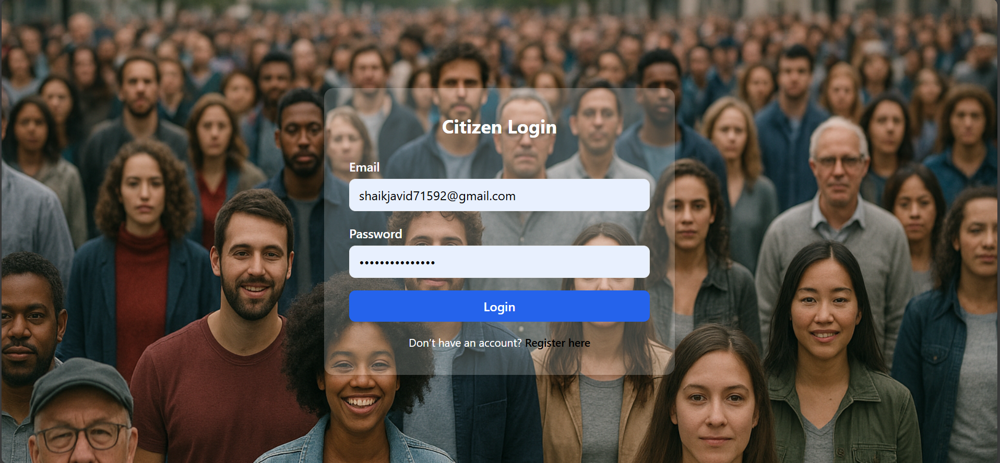
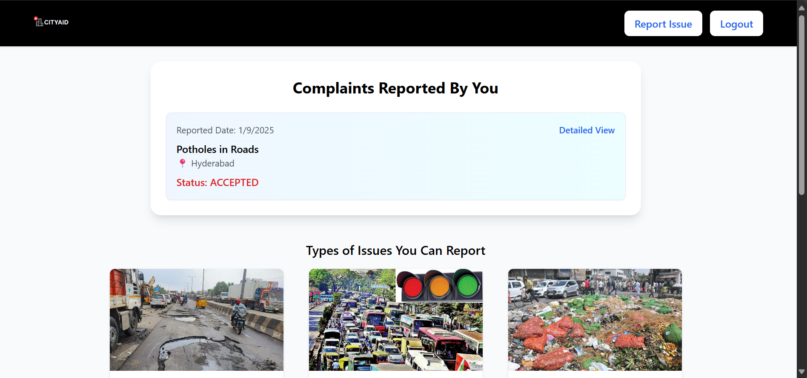
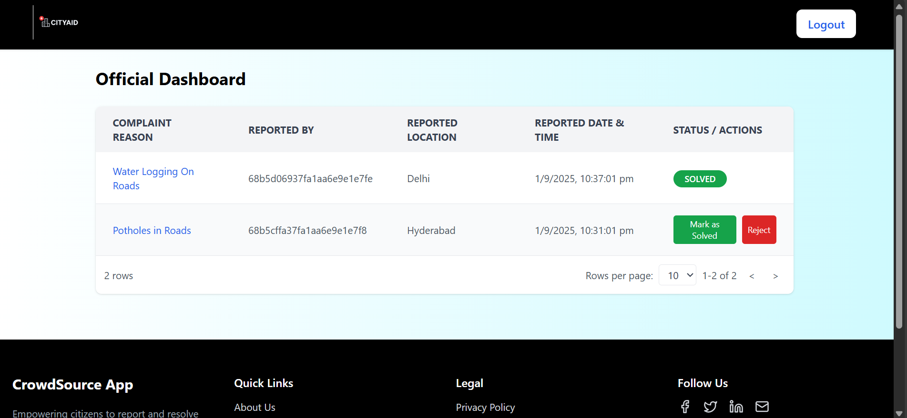
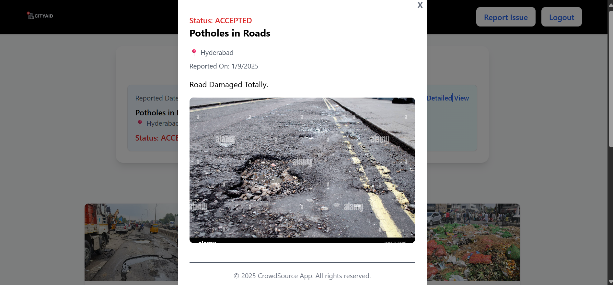

# 🌐 Crowdsource Client

A **MERN stack web application** designed to handle crowdsource-based complaints and issue tracking.  
Citizens can raise complaints, and authorities can manage and resolve them efficiently.

---

## 📸 Screenshots

### 🏠 Citizen Login


### 📝 Official Login


### 📊 Citizen Dashboard


### 👮 Official Dashboard


### 📑 Detailed Report


---

## 🚀 Features
- 📝 Citizens can **register complaints** with details and images  
- 📂 Complaints stored in **MongoDB** database  
- 👮 Authorities can **view and manage complaints**  
- 📊 Dashboard for tracking complaint status  
- 🔐 Secure authentication for users and admins  
- ⚡ Responsive UI built with React + Tailwind  

---

## 🛠 Tech Stack
- **Frontend**: React.js, Tailwind CSS  
- **Backend**: Node.js, Express.js  
- **Database**: MongoDB  
- **Version Control**: Git & GitHub  

---

## ⚙️ Installation & Setup

### 1️⃣ Clone the repository
```bash
git clone https://github.com/JAVID375/crowdsource-client.git
cd crowdsource-client
```

### 2️⃣ Install dependencies

#### For client
```bash
cd client
npm install
```

#### For server
```bash
cd ../server
npm install
```

### 3️⃣ Set up environment variables  
Create a `.env` file in the **server** folder with:

```
MONGO_URI=your_mongodb_connection_string
PORT=5000
JWT_SECRET=your_secret_key
```

### 4️⃣ Run the project

#### Start backend
```bash
cd server
npm start
```

#### Start frontend
```bash
cd client
npm start
```

👉 Open in browser: [http://localhost:3000](http://localhost:3000)

---

## 📂 Project Structure
```
crowdsource-client/
│
├── client/        # React frontend
│   ├── public/
│   └── src/
│
├── server/        # Node + Express backend
│   ├── models/
│   ├── routes/
│   └── uploads/   # complaint images
│
├── .gitignore
├── README.md
└── package.json
```

---

## 🤝 Contributing

Contributions are welcome! 🎉

1. Fork the repository  
2. Create your feature branch (`git checkout -b feature-xyz`)  
3. Commit changes (`git commit -m "Added xyz feature"`)  
4. Push to branch (`git push origin feature-xyz`)  
5. Open a Pull Request  

---

## 📜 License

This project is licensed under the MIT License.

---

## 👨‍💻 Author

Javid ([@JAVID375](https://github.com/JAVID375))
